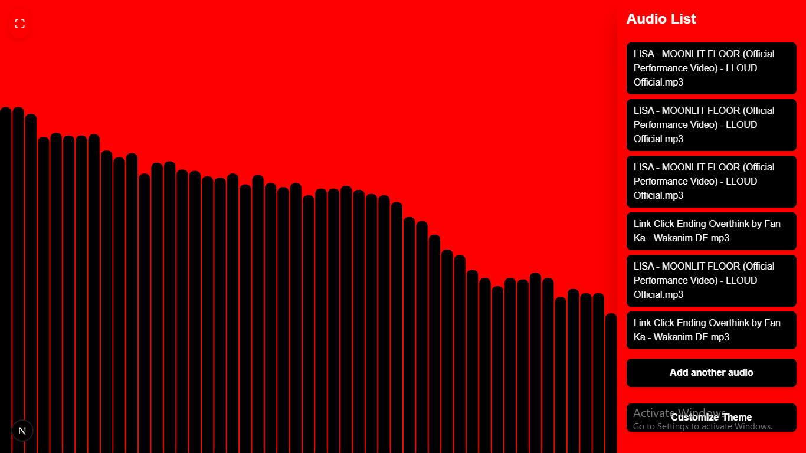

# 🎧 Audio Visualiser

A fun and colorful web app that lets you see your music in action! Upload or play audio and watch it transform into beautiful, dancing visual effects. Perfect for music lovers who want to experience their songs in a whole new way.

## What Can You Do?

- **Upload your audio** - Drop your favorite songs into the app
- **Watch beautiful visuals** - See animated bars and effects that dance to your music
- **Customize the look** - Change colors, themes, and visual effects to match your vibe
- **Simple to use** - Just hit start and go!

## Getting Started

### Requirements

- Node.js installed
- npm

### Install dependencies

```bash
npm install
```

### Run locally in development

```bash
npm run dev
```

> Note: this app may not behave consistently in dev mode. For the best local experience, use the production standalone build below.

## Built With

- **Next.js** - The web framework that powers this app
- **React** - Makes the interface interactive
- **Tailwind CSS** - Makes everything look pretty
- **Redux** - Keeps track of settings and what's playing

## What's Inside?

- `app/` - The main pages of the app
- `components/` - The different parts that make up the interface (visualizer, audio player, theme settings, etc.)
- `public/` - Images and other files

## Build and run locally (recommended)

This app works best when built and run in production mode.

```bash
npm run build
npm run start:standalone
```

If you want to run the normal Next.js production server instead, use:

```bash
npm run build
npm start
```

## Have Fun!





Made for people who love music and want to see it in a whole new way. Happy visualizing! 🎵


